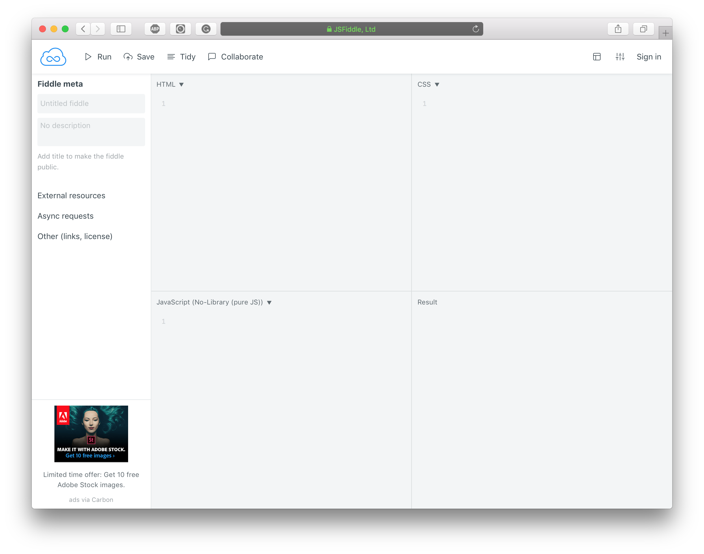

Mastering Vue is an advanced take on building applications with vue. The book takes the readers on a vuetiful journey of creating an app, undertaking a progressive learning approach, we begin with a minimal starter app and incrementally improve it throughout the book. We introduce new topics, discuss in detail and use in the app. It focuses on real-world use, and we will consider every tool available to vue ecosystem in detail.

For developers new to vue.js, we have this chapter which provides an adequate base to work through the book and mastering vue. It talks about the life cycle of a vue application, core concepts and building user interfaces with vue.

# What is Vue?

Vue _(pronounced /vjuː/, like view)_ is user interface library built with high regards to developer experience and performance. The creator, *Evan You*, advertises it as a progressive framework. Progressive _(aka continuing or developing)_; the core _(hereafter referred as vue)_ is just a view layer library, but with supporting libraries crafted to be incrementally adoptable, it creates a sense of framework.

It is first and foremost approachable. There is no need to scaffold a project, to learn new syntax or to set up complicated environment configuration. Add a script tag on an HTML page, and we are using vue.

Along with approachability, it is versatile enough to serve reactive needs of a portion of a page to a full-blown enterprise application. It starts with declarative rendering and reactivity as base building blocks, then as the application grows, include features like client-side routing, shared state management, animations, server rendering and much more.

With user attention span growing shorter and shorter, modern applications strive to be fast, and small size and blazing fast virtual DOM enable performance. The innovative reactivity system of vue keeps growing application performant as it always knows what is changing and tries to minimize render efforts by the browser. It also embodies various optimisations during bundling and tries to keep developer optimisation efforts at the minimum.

# A Vue Application
A vue application is a component tree mounted to a DOM element. Components are building blocks of a vue application. Functionally they are very much similar to HTML elements; we will know more about them in the following section. 

Let us create a small vue application. We would use [jsfiddle.net](https://jsfiddle.net) for all the examples in this chapter. The editor of jsfiddle.net has four sections; namely HTML, CSS, JavaScript, and Result. HTML section accepts contents of `<body>`. JavaScript section is appended after HTML section as a `<script>` element. CSS section is added to <head> of hence generated HTML page; which we can preview in Result section.

Let get to coding. Open jsfiddle.net.



First and foremost, we need vue in our fiddle. We would be using vue from a CDN. Go ahead and add following code in HTML section.

``` html
<script src="//unpkg.com/vue"></script>
<div id="app"></div>
```

We have vue in our fiddle now. Let's create a simple application. Put following script in JavaScript section.

``` js
new Vue({
  template: '<h1>Hello World</h1>'
}).$mount('#app')
```

Hit Run button to preview the application. In Result section, we would find a "Hello World" printed. Just like that, we have created our first vue application. _([jsfiddle.net/znck/bvasvc32](https://jsfiddle.net/znck/bvasvc32/))_

Let's break it up and understand what is happening. `new Vue({...})` creates an instance of the component. Here, `{ template: '<h1>Hello World</h1>' }` is a component with a string template; we would explore component API in next section. And at last `$mount('#app')` attaches the component instance to a DOM element matching `#app` selector. DOM element matching `#app` would be replaced with contents rendered by the component. If we inspect page, we will find that there is no `<div>` element on the page; instead an `<h2>` element replaces it.


