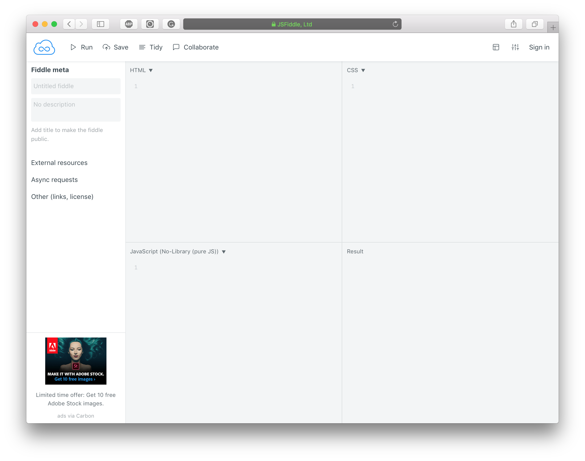
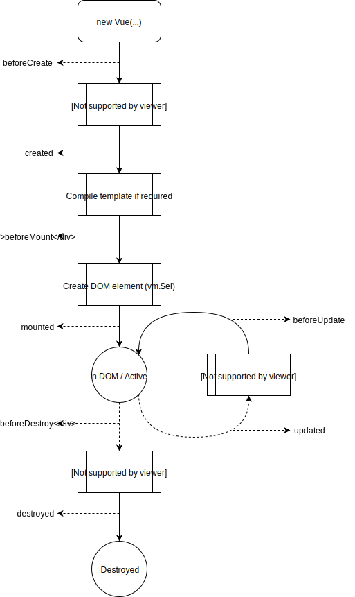

# Introduction

Mastering Vue is an advanced take on building applications with Vue. The book takes the readers on a vuetiful journey of creating an app, undertaking a progressive learning approach. We begin with a minimal starter app and incrementally improve it throughout the book. We shall introduce new topics as required and discuss in detail before using in the example application. It focuses on real-world use, and we will consider every tool available to Vue ecosystem in detail.

For developers new to Vue, this chapter will provides an adequate base to work throughout the book and help you mastering Vue. We focus on following fundamentals:

- What is Vue?
- What is a Vue application?
- Life cycle of a Vue application.
- What is declarative rendering?
- How to use template syntax?
- Using programming logic in templates.
- Handling events and form input.
- What is component composition?
- What are directives, mixins and filters?

## What is Vue?

Vue _(pronounced /vjuː/, like view)_ is user interface library built with high regards to developer experience and performance. The creator, _Evan You_, advertises it as a progressive framework. Progressive _(aka continuing or developing)_; the core _(hereafter referred as Vue)_ is just a view layer library, but with supporting libraries crafted to be incrementally adoptable, it creates a sense of framework.

It is first and foremost approachable. There is no need to scaffold a project, to learn new syntax or to set up complicated environment configuration. Add a script tag on an HTML page, and we are using Vue.

Along with approachability, it is versatile enough to serve reactive needs of a portion of a page to a full-blown enterprise application. It starts with declarative rendering and reactivity as base building blocks, then as the application grows, include features like client-side routing, shared state management, animations, server rendering and much more.

With user attention span growing shorter and shorter, modern applications strive to be fast. Vue's small size and blazing fast virtual DOM and reactivity system enable performance at scale.

## A Vue Application

A Vue application is a component tree mounted to a DOM element. Components are building blocks of a Vue application. Functionally they are very much similar to HTML elements; we will know more about them in the following section.

Let us create a small Vue application. We would use [jsfiddle.net](https://jsfiddle.net) for all examples in this chapter. The editor of jsfiddle.net has four sections:

- **HTML:** Contents are used as markup in `<body>`.
- **CSS:** Styles are inlined in the `<head>`.
- **JavaScript:** Appended after the contents of HTML section.
- **Result:** Renders preview of the above created webpage.

Let get to coding. Open jsfiddle.net.



First and foremost, we need Vue in our fiddle. We would be using Vue from a CDN service like JSDeliver or Unpkg. Go ahead and add the following code in HTML section.

```html
<script src="//unpkg.com/vue"></script>
<div id="app">
    <h1>Hello World</h1>
</div>
```

Now, We have `Vue` constructor available globally. Let's create a simple application. Put the following script in JavaScript section.

```js
new Vue({
  el: '#app'
})
```

Hit Run button to preview the application. In Result section, we would find a "Hello World" printed. Just like that, we have created our first Vue application. _([jsfiddle.net/znck/bvasvc32](https://jsfiddle.net/znck/bvasvc32/))_

Let's break it up and understand what is happening.

1.  We create an instance of `Vue`.
1.  The `el` property above is a selector string, and the target element of this selector is the mount point of our application. A Vue instance when mounted to a DOM element, renders content into the mount point and keeps DOM in sync with the application state.
1.  The inner content of `<div>` with id `app` is the template for the application.

Go ahead and inspect the page, we would find that Vue replaces the mount point (`<div id="app">`) with the rendered content.

### The Vue Instance

In above example, we created a Vue instance to demonstrate a "Hello World" application. Every application starts by creating an instance of Vue. The Vue constructor accepts an options object.

```js
new Vue({
  // options
})
```

The options are same as component API except some root specific options. We will talk about these options in advanced components chapter.
Next we will look into reactive state and life-cycle of Vue instance.

#### Data and Methods

When a Vue instance is created, it includes all the `data` option properties found in the reactivity system and also surfaces them as instance properties.

```js
const app = new Vue({
  data: { foo: 0 }
})

app.foo // = 0
app.foo === 0 // = true
```

The `data` option properties are reactive.

```js
const data = { foo: 1 }
const app = new Vue({
  data
})


app.foo // = 1
data.foo // = 1

// Changing `foo` on Vue instance.
app.foo += 1

app.foo // = 2
data.foo // = 2

// Changing `foo` on original data object.
data.foo += 1

app.foo // = 3
data.foo // = 3
```

Only the `data` properties present at the time of instance creation are reactive.

```js
const data = { foo: 2 }
const app = new Vue({
  data
})

app.foo // = 2

data.bar = 1 // It won't be added to `app`.

app.bar // = undefined

```

Frozen objects are also not reactive.

```js
const data = Object.freeze({ foo: 3 })
const app = new Vue({
  data
})

app.foo // = 3

data.foo = 1

app.foo // = 3

```

In addition to surfacing `data` properties, Vue instance exposes some useful instance properties and methods. These are prefixed with `$` to prevent any possible collision with user-defined `data` properties.

Similar to `data`, all `methods` properties are also surfaced as instance methods and bound to `this` context of the Vue instance.

```js
const app = new Vue({
  methods: {
    foo() {
      this // = app

      return 'foo'
    }
  }
})

app.foo() // = 'foo'
```

#### Life-cycle Hooks

A Vue instance on creation goes through a series of initialization steps, e.g., observe data, compile template, mount instance into the DOM, update DOM when data changes.
It is possible to execute custom logic at specific stages using special functions called life-cycle hooks. Following are the hooks called at different stages of Vue instance:

1. `beforeCreate`
2. `created`
3. `beforeMount`
4. `mounted`
5. `beforeUpdate`
6. `updated`
7. `beforeDestroy`
8. `destroyed`

The life-cycle hooks are invoked with their `this` context pointing to the Vue instance calling it.



## Getting Started

Before diving into the world of Vue applications, we will look into the very fundamentals.

### Declarative Rendering

The core function of Vue is declaratively rendering data/state into the page DOM. Let's try a quick example. ([jsfiddle.net/znck/xtv4c5mg](https://jsfiddle.net/znck/xtv4c5mg/))

```html
<script src="//unpkg.com/vue"></script>
<div id="app">
    <h1>Hello {{ name }}</h1>
</div>
```

```js
const app = new Vue({
  el: '#app',
  data: {
    name: 'John'
  }
})
```

The `data` property defines the state of the application. The values defined in `data` property are available on the instance, i.e., `app.name` is `'John'`. The template renders in the data scope of the instance, i.e., when say `name`, it is `name` property of the data part of the component.

We use the mustache syntax to use the state in our template. We see the page has text as "Hello John".

It may look similar to template processors like handlebars, but there is a lot more going on here. The data and DOM are bound together and it's reactive, i.e., if we update `name`, it would reflect in the DOM. Let's try this out, append following snippet to above script.

```js
setTimeout(() => {
  app.name = 'Jane'
}, 3000)
```

Here, we set the name to 'Jane' after 3 seconds. We would see that the text on the page would change from "Hello John" to "Hello Jane". We can use component state in the template, and the page would update when the state changes. In the next section, we will explore the template syntax in detail.

### Template Syntax

Vue uses HTML-based template syntax which can be parsed by spec-complaint browsers and parsers. The template is declarative way of rendering application state into DOM node.

The template is converted to JavaScript render function which in turn generates virtual DOM. When state changes, the reactivity system figures outs the effected components and the re-render is triggered to generate new virtual DOM nodes. Vue compares the new virtual DOM nodes with the old virtual DOM tree to find a minimum number of DOM changes.

The template syntax extends HTML with following features:

- Interpolations

#### Interpolations

Interpolation allows binding of javascript variables and expressions to DOM. The template syntax provides two ways of data binding.

##### Text

The "Mustache" like syntax allows putting any javascript expression as text.

```html
<span>Message: {{ msg }}</span>
```

The value of `msg` property from data part of the component replaces the mustache tag, i.e., if `msg` is "Say hello!", then the rendered DOM would have `<span>Message: Say hello!</span>`.

The expressions in mustache tag can be any valid javascript expression. For example:

```html
<div>
  {{ 1 + 1 }} - Algebric expression
  {{ 'hello' + 'world' }} - String concatenation
  {{ (x => x * x)(5) }} - Immidiately invoked function expression
  {{ 1 == '1' ? 'yes' : 'no' }} - Ternary expression
</div>
```

Vue processes the expression in the mustache tag in the data scope of the corresponding component. Hence, `msg` property should be part of the data object of the corresponding component. It also sanitizes the evaluated value of the expression to prevent possible XXS vulnerabilities.

Moreover, the expressions are sandboxed and only have access to few whitelisted globals such as `Math` and `Date`.

The mustaches interpret data as plain text, but there are times when we want to interpolate some HTML string, Vue has special syntax for these situations; `v-html` directive. We will discover more about it in the next section.

##### Attributes

The mustache syntax interpolation is not possible inside HTML attributes. We use a directive (`v-bind`) for binding data to HTML attributes.

```html
<div v-bind:class="someClassName"></div>
```

In above example, we are binding the `someClassName` expression to `class` attribute. Generically, we can write `v-bind:<attribute>="<expression>"` is the syntax for binding HTML attributes.

The attribute binding behavior for boolean properties is slightly different. If the expression evaluates to a _falsy_ value, then the attribute will not be included in the rendered DOM. `null`, `undefined`, and `false`, all are _falsy_ values.

#### Directives

The directives are specific attributes with `v-` prefix. The directive syntax is as follows:

```html
v-<directive-name>:<argument>.<modifier>="<expression>"
```

Examples:

```html
<b v-once>{{ msg }}</b>
<a v-on:click="handleClick">...</a>
<form v-on:submit.prevent="onSubmit">...</form>
```

A directive has a name, an optional argument, one or more optional modifiers and an optional expression. The directive name is unique kebab cased string. If we want to name our directive `my-awesome-directive`, then the directive would be `v-my-awesome-directive` is the attribute name to use the directive.

The expression is a javascript expression same as in text interpolation and attributes binding.

##### Argument

A directive can accept an argument, denoted by a colon after the directive name. For example, the `v-bind` directive binds data to HTML attributes.

```html

```

Here `src` is the argument. `v-bind` uses the argument to determine that `src` attribute of `` tag should be the value of the expression `url`.

##### Modifiers

The modifiers are boolean values which directives may use to enable or disable the provided features.

For example, when we use the `v-on` directive with the `.prevent` modifier, it calls `event.preventDefault()` on the triggered event.

```html
<form v-on:submit.prevent="onSubmit">...</form>
```

##### Built-in Directives

<!-- TODO: Add intro paragraph -->

###### v-text

`v-text` updates the element's `textContent`. In behavior, it is same as the mustache syntax for text interpolation. It sanitizes the value of the expression before setting it as the `textContent`.

Example:

```html
<span v-text="msg"></span>
<!-- is same as -->
<span>{{ msg }}</span>
```

###### v-html

`v-html` updates the element's `innerHTML`. It inserts the value of the expression as `innerHTML` of the target element.

Example:

```html
<div v-html="markdownOutput"></div>
```

<p class="packt_infobox">

Dynamically rendering arbitrary HTML can be very dangerous as it may lead to XSS attacks. Use `v-html` only on trusted content and never on user-provided content.

</p>

###### v-show

`v-show` toggles the element's visibility by setting `display` CSS property. For a falsy value of the expression, it hides the element.

Example:

```html
<span v-show="isInvalid">Invalid email</span>
```

When the value of `isInvalid` is false, it would add style `display: none` to the `<span>` element.

This directive triggers transitions when its expression value changes. We will discuss transitions in later chapters.

###### v-if

`v-if` renders the element based on the truthy-ness of the expression value. The element and its child components and contained directives are destroyed and re-created during toggles.

Example:

```html
<span v-if="isInvalid">Invalid email</span>
```

When the value of `isInvalid` is false, `v-if` directive removes the element `<span>` from the DOM and destroys it.

This directive triggers transitions when its expression value changes.

###### v-else

`v-else` provides else block to `v-if` and `v-else-if` directives. The element with `v-else` directive should appear immidiately after the element with `v-if` or `v-else-if` directive.

Example:

```html
<span v-if="isInvalid">Invalid email</span>
<span v-else>Yep! you got it right.</span>
```

###### v-else-if

`v-else-if` provides conditional chain. The element with `v-else-if` directive should appear immediately after the element with `v-if` directive.

Example:

```html
<span v-if="isInvalid">Invalid email</span>
<span v-else-if="isEmpty">Please provide you email address</span>
```

We will explore `v-if`, `v-else` and `v-else-if` directives in detail in conditional rendering section.

###### v-for

`v-for` renders the element or template block multiple times based on the source data.

Example:

```html
<div v-for="item in items">
  {{ item }}
</div>
```

We will explore `v-for` directive in detail in list rendering section.

###### v-on

`v-on` attaches an event listener to the element.

Example:

```html
<button v-on:click="handleClick">...</button>
```

The `v-on` directive is used very often, so Vue provides a shorthand syntax for it. We can use `@click` instead of `v-on:click`.

```html
<button @click="handleClick">...</button>
```

We will explore `v-on` directive in detail in event handling section.

###### v-bind

`v-bind` dynamically binds one or more attributes or component props.

Example:

```html

```

The `v-bind` directive is used very often, so Vue provides a shorthand syntax for it. We can use `:src` instead of `v-bind:src`.

```html

```

The `v-bind` directive provides following modifiers:

- `.prop` - Bind as a DOM property instead of an attribute. If the element tag is a component, then it will set the DOM property on the component's `$el` element.
- `.camel` - Transform kebab-case attribute name into camelCase.
- `.sync` - A syntax sugar that expands into a `v-on` handler to update the bound value. By convention, the update event is `update:<property>`. For example:

  ```html
  <MyComponent v-bind:name.sync="myName" />

  <!-- is same as -->

  <MyComponent v-bind:name="myName" v-on:update:name="name = $event" />
  ```

###### v-model

`v-model` is syntax sugar for binding value with `v-bind` and `v-on` handler to update the bound value. It creates a two-way binding on a form input element or a component.

Example:

```html
<input v-model="name">
```

We will explore `v-model` directive in detail in form input handling section.

###### v-pre

`v-pre` skips interpolation of the element and its children.

Example:

```html
<span v-pre>{{ this will not be comiled }}</span>
```

###### v-cloak

`v-cloak` will remain on the element until the associated Vue instance finishes compilation. It can be used to hide un-compiled mustache binding until the Vue instance is ready when using in-DOM templates.

`v-cloak` should be combined with CSS rules such as `[v-cloak] { display: none; }`.

```css
[v-cloak] {
  display: none;
}
```

```html
<div v-cloak>{{ msg }}</div>
```

###### v-once

`v-once` will render the element or component only once and on subsequent renders the element or component and its children are treated as static content. Using `v-once` on large DOM trees can optimize the update performance.

Example:

```html
<span v-once>Created at: {{ new Date() }}</span>
```

### Conditional Rendering

Programming languages have _if_ statement for conditionally executing some part of the code. Vue has a similar construct for conditionally rendering some part of the template. The `v-if`, `v-else`, `v-else-if` and `v-show` directives instruct Vue to conditionally render elements.

```html
<h1 v-if="firstTimeUser">Welcome to Vue</h1>
```

The `<h1>` element is rendered when the expression `firstTimeUser` is true.

We can use `v-else` directive to add _else_ block.

<p class="packt_infobox">

The element with `v-else` directive should appear immediately after the element with `v-if` or `v-else-if` directive.

</p>

```html
<span v-if="hasError">There is some error.</span>
<span v-else>All good!</span>
```

The `v-else-if` directive allows multiple conditional blocks.

```html
<span v-if="isMorning">Good Morning</span>
<span v-else-if="isNoon">Good Afternoon</span>
<span v-else-if="isNight">Good Night</span>
<span v-else>Good Evening</span>
```

<p class="packt_infobox">

The element with `v-else-if` directive should appear immidately after the element with `v-if` or `v-else-if` directive.

</p>

#### Conditional Groups

A directive can be attached to a single element. However, when we need to toggle more than one element, we can use `<template>` element. The `<template>` element serves as a transparent wrapper, and the final result does not include it.

```html
<template v-if="ok">
  <h1>Title</h1>
  <p>Para 1</p>
  <p>Para 2</p>
</template>
```

#### Controlling Reusable Elements

Whenever possible, Vue re-uses elements when rendering conditional blocks which makes Vue very fast. We can take advantage of these re-used elements, e.g. `<input>` element preserves the entered text as the element is re-used.

```html
<template v-if="loginType === 'username'">
  <label>Username</label>
  <input placeholder="Enter your username">
</template>
<template v-else>
  <label>Email</label>
  <input placeholder="Enter your email address">
</template>
```

As both templates use same elements, the elements are re-used and `<input>` preserves its value. Only the `placeholder` attribute is updated.

The re-use of the element is not always desirable though; we should add a `key` attribute with unique values to tell Vue not to re-use the element.

```html
<template v-if="one">
  one
  
</template>
<template v-else>
  other
  
</template>
```

In above example, if we do not use `key` attribute on `` element then we would see a flash of the old image.

#### Conditionally Displaying Elements

We may use `v-show` directive for optionally displaying an element.

```html
<button v-show="isValid">submit</button>
```

The `v-show` conditional rendering is different from `v-if`. With `v-show`, the element is always rendered. It only toggles the `display` CSS property of the element.

<p class="packt_infobox" markdown>

The `v-show` directive does not support `<template>` element.

</p>

##### Comparing `v-show` with `v-if`

`v-if` is conditional rendering. For false condition, it does not render the element at all. The event listeners and child components inside the conditional block are destroyed and re-created during toggles. It also renders lazily, if the condition is false on initial render, it will skip the render and won't render until the condition becomes true.

`v-show` does not affect the rendering behavior. Depending upon the expression value, it toggles `display` CSS property to hide or show the element.

`v-if` has higher toggle cost compared to `v-show`. So prefer `v-show` when the condition toggles very often.

### List Rendering

List of messages in a chat application, list of products in an online store, list of articles in a blog. Rendering a list of elements is the most common task in real-world applications. The `v-for` directive allows to iterate over lists and render HTML elements.

Example:

```html
<ul>
  <li v-for="movie in movies">
    {{ movie }}
  </li>
</ul>
```

```js
new Vue({
  el: '#app',
  data: {
    movies: ['Batman Begins', 'The Dark Knight', 'The Dark Knight Rises']
  }
})
```

Results:

- Batman Begins
- The Dark Knight
- The Dark Knight Rises

The `v-for` directive requires a special syntax for expression in the form of `movie in movies`, where `movies` is the source array and `movie` is an alias for the current array element.

The `v-for` expression also supports an optional second argument for the index of the current array element.

```html
<ul>
  <li v-for="(movie, index) in movies">
    {{ index }} - {{ movie }}
  </li>
</ul>
```

Results:

- 1 - Batman Begins
- 2 - The Dark Knight
- 3 - The Dark Knight Rises

The `v-for` directive also works with objects.

```html
<ul>
  <li v-for="(value, key) in user">
    {{ key }} = {{ value }}
  </li>
</ul>
```

```js
new Vue({
  el: '#app',
  data: {
    user: {
      firstName: 'John',
      lastName: 'Doe',
      email: 'john@example.com'
    }
  }
})
```

Result:

- firstName = John
- lastName = Doe
- email = john@example.com

<p class="packt_infobox">

When iterating an object with `v-for` directive, the order is same as enumeration order of `Object.keys()` which is **not** guaranteed to be consistent across javascript engines.

</p>

The `v-for` directive can take an integer as a source, in this case, it will repeat the element that many times. For example:

```html
<div>
  <span v-for="i in 10">{{ i }}</span>
</div>
```

The `v-for` directive can be attached to a `<template>` element to render a list of multiple elements. For example:

```html
<div>
  <template v-for="movie in movies">
    
    <span>{{ movie.title }}</span>
  </template>
<div>
```

The `v-for` directive has higher priority than `v-if` directive and when they exist on the same node, `v-if` would execute on each iteration of the loop. The higher priority of `v-for` can be useful when we want to render only some items. For example:

```html
<li v-for="movie in movies" v-if="!movie.isWatched">
  {{ movie.title }}
</li>
```

The above template renders only unwatched movies.

<p class="packt_tip">

Computed properties should be preferred over `v-for` - `v-if` combo, whenever only some items from the list need to be rendered.

</p>

If the intent is to skip execution of the loop then we can place `v-if` on a wrapper element (or `<template>`). For example:

```html
<ul v-if="newMovies.length">
  <li v-for="movie in newMovies">
    {{ movie.title }}
  </li>
</ul>
<p v-else>No new movies!<p>
```

#### Controlling Reusable Elements

Vue uses _in-place patch_ as default strategy when `v-for` list items are rerendered. If the order of items has changed, instead of rearranging DOM elements, Vue will patch each element in-place to match the order of the items.

In-place patch is efficient, but only suitable when the list render output does not rely on child component state or temporary DOM state (e.g., form input values). We should add a `key` attribute with unique values to help Vue tracking identity of the rendered elements.

```html
<div v-for="item in items" :key="item.id">
  <!-- content -->
</div>
```

It is recommended to provide a `key` with `v-for` whenever possible unless the iterated DOM is simple.

#### Array Change Detection

Vue wraps on observed array's mutation methods so they will also trigger view updates. The wrapped methods are:

- `push()`
- `pop()`
- `shift()`
- `unshift()`
- `splice()`
- `sort()`
- `reverse()`

Other methods which do not mutate the original array do not trigger any updates. Non-mutating methods always return a new array. When working with these methods, the old array should be replaced with new one.

```js
app.movies = app.movies.filter(movie => movie.startsWith('The'))
```

When an array is replaced with another array, Vue uses heuristics to maximize DOM element reuse, and the replacement operation is very efficient when two arrays contain overlapping items.

##### Caveats

There are few cases when Vue cannot detect changes to an array:

1.  When an item is set with the index, e.g., `app.items[index] = newValue`
    We can use `splice()` method for this.

```js
app.items.splice(index, 1, newValue)
```

Alternatively, Vue offers a method to set array items with indices.

```js
Vue.set(app.items, index, newValue)
```

1.  When the length of the array is modified, e.g., `app.items.length = newLength`
    We can use `splice()` method for this.

```js
app.items.splice(newLength)
```

#### Object Change Detection

Vue wraps an observed object with a proxy object using getters and setters, so it triggers view updates if any property changes.

```js
const app = new Vue({
  template: '<span>{{ a }}</span>'
  data: {
    a: 1
  }
})
```

`app.a` is now reactive. Updating `app.a` would trigger view update.

##### Caveats

There are few cases when Vue cannot detect changes to an object:

1.  When a new property is added to the object:

```js
const app = new Vue({
  template: '<span>{{ a }}</span>'
  data: {
    a: 1
  }
})

app.b = 2
```

`app.b` is not reactive and Vue does not allow adding new root-level properties to an already created instance. However, it is possible to add new reactive properties to a nested object using the `Vue.set(object, key, value)` method. For example:

```js
const app = new Vue({
  data: {
    user: {
      name: 'John Doe'
    }
  }
})

Vue.set(app.user, 'age', 25)
```

1.  When some new properties are added to the object:
    Using `Vue.set()` for a couple of new properties can be verbose, we may want to use `Object.assign()` or `_.extend()`. **Do not extend or assign observed object in-place.**

```js
Object.assign(app.user, { age: 25 }) // avoid this.
```

In such cases, it is recommended to create a fresh object with properties from both the objects.

```js
app.user = Object.assign(
  {
    /* new object */
  },
  app.user,
  { age: 25 }
)

// or use object spread operator.

app.user = { ...app.user, age: 25 }
```

### Event Handling

User interactions on a webpage trigger DOM events. These events let us know if some element is clicked or the input field is focused, or the form is submitted.

We can use the `v-on` directive to listen to DOM event. For example:

```html
<div>
  <button v-on:click="counter += 1">Add 1</button>
  <p>The button has been clicked {{ counter }} times.</p>
</div>
```

```js
const app = new Vue({
  el: '#app',
  data: {
    counter: 0
  }
})
```

In above example, `v-on` binds the inline expression with DOM click event and whenever the button is clicked, the `counter` property is incremented by 1.

In practice, the logic for event handlers is more complicated and it is not possible to keep that much code in the `v-on` expression. We should put the event handler logic in a method and use method name as `v-on` expression. For example:

```html
<button v-on:click="sayHi">Hello</button>
```

```js
const app = new Vue({
  el: '#app',
  methods: {
    sayHi() {
      alert('Hi there!')
    }
  }
})
```

The inline `v-on` expression has access to the original DOM event. The DOM event can be accessed using `$event` variable. For example:

```html
<button v-on:click="sayHi('Vue.js', $event)">
  Hello
</button>
```

```js
const app = new Vue({
  el: '#app',
  methods: {
    sayHi(name, event) {
      // Let's prevent event bubling up.
      if (event) event.stopPropagation()
      alert('Hi ' + name + '!')
    }
  }
})
```

There is a shorthand syntax for `v-for`, instead of `v-on:click`, we may use `@click`. For example:

```html
<button @click="sayHi('Vue.js', $event)">
  Hello
</button>
```

#### Event Modifiers

The `v-on` directive provides some useful modifiers. These modifiers can perform common tasks, and our event handler would be purely about data logic rather than dealing with DOM event quirks.

Following modifiers are available for `v-on` directive:

- `.stop` - call `event.stopPropagation()`.
- `.prevent` - call `event.preventDefault()`.
- `.once` - trigger event listner at most once.
- `.self` - trigger event listner only when target element is the element itself.
- `.capture` - add event listner in [capture mode](https://developer.mozilla.org/en-US/docs/Web/API/EventTarget/addEventListener).
- `.passive` - add event listner in [passive mode](https://developer.mozilla.org/en-US/docs/Web/API/EventTarget/addEventListener).

<p class="packt_infobox">

The order of modifiers is important as the relevant code is generated in same order.
For example, `@click.prevent.self` will prevent all clicks while `@click.self.prevent` will only prevent the clicks on the element.

</p>

#### Key Modifiers

When listening to keyboard event, we often look for specific keys are pressed or not. The `v-on` provides modifiers to bind event listeners to particular keys.

```html
<input v-on:keyup.enter="submit">

<input @keyup.enter="submit">
```

We may use `keyCode` as `v-on` modifier.

```html
<input @keydown.13="handleIt">
```

The built-in key modifiers are as follows:

- `.delete` (captures both "Delete" and "Backspace" keys)
- `.enter`
- `.esc`
- `.space`
- `.tab`
- `.up`
- `.down`
- `.left`
- `.right`

Moreover, we may define aliases for other keys using global `config.keyCodes` object.

```js
Vue.config.keyCodes.f1 = 112
```

```html
<input @keydown.f1="handleIt">
```

In modern browsers, `v-on` directive offers automatic key modifiers. We may use any valid key name exposed via `KeyboardEvent.key` as modifiers by converting them to kebab-case.

```html
<input @keyup.page-down="handlePageDown">
```

#### System Key Modifiers

These modifiers can be used with keyboard or mouse events. They trigger the listener only when the corresponding modifier key is pressed.

Following are system key modifiers corresponding to the system keys:

- `.ctrl`
- `.alt`
- `.shift`
- `.meta`

Example:

```js
<input @keyup.meta.c="copy">
```

`v-on` has the `.exact` modifier which ensures the exact combination of the system modifiers to trigger the event listener. For example:

```js
<input @keyup.meta.c.exact="copy">
```

#### Mouse Button Modifiers

These modifiers can be used to restrict mouse events to a specific mouse button.

Following are mouse button modifiers:

- `.left`
- `.right`
- `.middle`

### Form Input Handling

We use the `v-model` directive to create two-way data bindings on form elements. It automatically pics the correct way to update the element based on the input type. For example:

```html
<input v-model="name">
```

The `v-model` directive may seem magical, but in reality, it is syntax sugar for updating the bound value on user input events, though it handles some edge cases too. Above example can be written as follows:

```html
<input :value="name" @input="name = $event.target.value">
```

#### Input Types

Let's open jsfiddle.net and try out following examples.

##### Text

```html
<div>
  <input v-model="message">
  <p>Message is: {{ message }}</p>
</div>
```

```js
const app = new Vue({
  el: '#app',
  data: {
    message: ''
  }
})
```

##### Multiline Text

```html
<div>
  <textarea v-model="message"></textarea>
  <p style="white-space: pre-line;">Message is: {{ message }}</p>
</div>
```

```js
const app = new Vue({
  el: '#app',
  data: {
    message: ''
  }
})
```

##### Checkbox

A single checkbox bound to a boolean value:

```html
<div>
  <input type="checkbox" v-model="checked">
  <p>Checkbox is: {{ checked }}</p>
</div>
```

```js
const app = new Vue({
  el: '#app',
  data: {
    checked: false
  }
})
```

Multiple checkboxes bound to the same Array:

```html
<div>
  <label>
    <input type="checkbox" value="Batman Begins" v-model="watched"> Batman Begins
  </label>
  <label>
    <input type="checkbox" value="The Dark Knight" v-model="watched"> The Dark Knight
  </label>
  <label>
    <input type="checkbox" value="The Dark Knight Rises" v-model="watched"> The Dark Knight Rises
  </label>
  <p>Watched movies: {{ watched }}</p>
</div>
```

```js
const app = new Vue({
  el: '#app',
  data: {
    watched: []
  }
})
```

##### Radio

```html
<div>
  <label>
    <input type="radio" value="Batman Begins" v-model="movie"> Batman Begins
  </label>
  <label>
    <input type="radio" value="The Dark Knight" v-model="movie"> The Dark Knight
  </label>
  <label>
    <input type="radio" value="The Dark Knight Rises" v-model="movie"> The Dark Knight Rises
  </label>
  <p>Watching: {{ movie }}</p>
</div>
```

```js
const app = new Vue({
  el: '#app',
  data: {
    movie: null
  }
})
```

##### Select

Single select:

```html
<div>
  <select v-model="movie">
    <option disabled value="">Please select one</option>
    <option value="Batman Begins">Batman Begins</option>
    <option value="The Dark Knight">The Dark Knight</option>
    <option value="The Dark Knight Rises">The Dark Knight Rises</option>
  </select>

  <p>Watching: {{ movie }}</p>
</div>
```

```js
const app = new Vue({
  el: '#app',
  data: {
    movie: ''
  }
})
```

Multiple select:

Single select:

```html
<div>
  <select v-model="movies" multiple>
    <option value="Batman Begins">Batman Begins</option>
    <option value="The Dark Knight">The Dark Knight</option>
    <option value="The Dark Knight Rises">The Dark Knight Rises</option>
  </select>

  <p>Watchlist: {{ movies }}</p>
</div>
```

```js
const app = new Vue({
  el: '#app',
  data: {
    movies: []
  }
})
```

Dynamic options rendered with `v-for`:

```html
<div>
  <select v-model="movie">
    <option disabled value="">Please select one</option>
    <option v-for="movie in movies" :value="movie">{{ movie }}</option>
  </select>

  <p>Watching: {{ movie }}</p>
</div>
```

```js
const app = new Vue({
  el: '#app',
  data: {
    movie: '',
    movies: ['Batman Begins', 'The Dark Knight', 'The Dark Knight Rises']
  }
})
```

<p class="packt_infobox">

If the initial value of the `v-model` expression does not match with any of the options, the `<select>` element will render it an "unselected" state. It is recommended to provide a disabled option with an empty value, as demonstrated in the above examples.

</p>

#### Value Binding

We can bind custom value on a radio input, a checkbox, or a select option.

##### Checkbox

```html
<input
  type="checkbox"
  v-model="confirm"
  true-value="yes"
  false-value="no"
>
```

When checked, the value of `confirm` property would be `'yes'`, and for the unchecked state it would be `'no'`.

##### Radio

```html
<input type="radio" v-model="pick" :value="a">
```

```js
const app = new Vue({
  el: '#app',
  data: {
    pick: '',
    a: { some: 'object' }
  }
})
```

When checked, `app.pick` is equal to `app.a`.

##### Select

```html
<select v-model="choose">
  <option :value="{ number: 123 }">123</option>
</select>
```

When selected, `app.choose` is equal to `{ number: 123 }`.

#### Modifiers

`v-model` provides following modifiers:

- `.lazy` - By default `v-model` syncs the input with data after each `input` event, when `.lazy` modifier is used, it syncs after `change` event.

  ```html
  <input v-model.lazy="msg">
  ```

- `.number` - Typecast value as a number. This modifier is useful with input `type="number"` as the HTML input element always returns a string.

  ```html
  <input v-model.number="age" type="number">
  ```

- `.trim` - It trims trailing and leading spaces of the value.

  ```html
  <input v-model.trim="query" type="search">
  ```

#### Input Components

`v-model` directive can be used with components too. The component should accept `value` prop and emit `input` event to support `v-model`. We will explore input components in detail in next section.

### Components

Components are custom elements that encapsulate reusable code and extend HTML elements. They are also Vue instances, and so accept the same options object and provide the same lifecycle hooks.

#### Registration

We can use `Vue.component(tag, options)` method to register components. Components registered using this method are available globally.

Example:

```html
<my-component></my-component>
```

```js
Vue.component('my-component', {
  template: '<div>A custom component</div>'
})

const app = new Vue({
  el: '#app'
})
```

Above app would render:

```html
<div>A custom component!</div>
```

We may use `components` instance option to register the component in the scope of the instance/component.

```js
const MyComponent = {
  template: '<div>A custom component</div>'
}

const app = new Vue({
  el: '#app',
  components: {
    'my-component': MyComponent
  }
})
```

<p class="packt_infobox">

When using the DOM as the template (e.g., using `el` option to mount an element with existing content), there are some restrictions as Vue can only retrieve template after the browser had parsed and normalized the HTML contents of the page. The most prominent restrictions are constraints on what elements can appear in `<ul>`, `<ol>`, `<table>` and `<select>` elements. As a workaround, Vue uses `is` attribute to tell the actual component to be rendered for the element. For example:

```html
<table>
  <tr is="my-component"></tr>
</table>
```

**These limitations do not apply when using string templates from one of the following sources:**

- `<script type="text/x-template">`
- JavaScript inline template strings
- Single file components (`.vue` file)

</p>

#### Composition

Components are meant to be in similar fashion to HTML elements. However, there is an inevitable need for communication between components. However, it very important to keep components decoupled so the component's code can be written and reasoned in isolation.

In Vue, the parent and child components communicate using **props** and **events**. The parent component passes data down to child components via props, and the child component sends messages to the parent component via events.


#### API

A component is like a black box. It hides all its implementation details from other components. Components need to communicate with each other to compose an application. The component exposes following interfaces to facilitate inter-component communication:

##### Props

A prop is a custom attribute for receiving information from the parent component. Props allow the external environment to pass data to the component. The component needs to declare the props it expects explicitly. We use the `props` option to do so.

For example:

```js
Vue.component('child', {
  props: ['message'],
  template: `<span>{{ message }}</span>`
})
```

When using the `<child>` component, we pass the `message` prop as following:

```html
<child message="Hello!"></child>
```

We can bind props using `v-bind` directive or the shorthand form.

```html
<div>
  <input v-model="name">
  <child :message="'Hello ' + name + '!'"></child>
</div>
```

**Props are read-only**, so they cannot be mutated, and Vue would throw warnings in the console if we try to mutate them.

The component can specify prop requirements and validate them. We define props with validation requirements using object syntax. For example:

```js
Vue.component('my-component', {
  props: {
    one: Number,
    two: [String, Number],
    three: {
      type: String,
      required: true
    },
    four: {
      type: Number,
      default: 1000
    },
    five: {
      type: Object,
      default() {
        return { name: 'John Doe' }
      }
    },
    six: {
      validator(value) {
        return value > 10
      }
    }
  }
})
```

In above example, the prop

- `one` has a type check. It should be numeric. The prop type can be `String`, `Number`, `Boolean`, `Function`, `Object`, `Array`, `Symbol` or any constructor with which `instanceof` assertion can be made.
- `two` accepts multiple types. It can be a string or a number.
- `three` should get a string value. It is a necessary prop when missed Vue would throw an error.
- `four` should be a number, and it has a default value of 1000. The default value is used if parent component does not provide value for prop `four`.
- `five` should be an object. It defines default value as factory function. For props of type `Object`, `Array`, `Function` and user-defined classes, a factory function is required for the default value.
- `six` defines a custom validator. The incoming prop value should pass the custom validation.

All non-prop attributes passed by the parent component will be added to component's root element. For example:

```html
<child data-extra-attr></child>
```

The `data-extra-attr` attribute would be added to the root element of `<child>` component.

<p class="packt_infobox">

As HTML attributes are case-insensitive, so when using non-string templates, camelCased prop names should be used as their kebab-case equivalents.

For example:

```js
Vue.component('child', {
  props: ['myMessage'],
  template: `<span>{{ myMessage }}</span>`
})
```

```html
<child my-message="Hello!"></child>
```

</p>

##### Events

Component events are similar to native DOM events. Events allow the component to trigger side effects in the external environment.

The Vue events interface:

- `$on(eventName, listener)` for listening to an event.
- `$emit(eventName, payload)` for triggering an event.

A parent component can use `v-on` to listen to the events emitted from child components.

Example:

```html
<div>
  <p>{{ total }}</p>

  <my-counter @increment="total += 1"></my-counter>
</div>
```

```js
Vue.component('my-counter', {
  template: `<button @click="increment">+</button>`,
  data: () => {
    return { counter: 0 }
  },
  methods: {
    increment() {
      this.counter += 1

      this.$emit('increment')
    }
  }
})

const app = new Vue({
  el: '#app',
  data: {
    total: 0
  }
})
```

In this example, `<my-counter>` component emits `increment` events. The parent component listens to `increment` events and updates the value `total` accordingly.

##### Slots

Slots are holes in a component which receive content from the parent component. The process of interweaving the parent content and the component's template is called content distribution. Slots allow the external environment to compose the component with extra content.

Vue implements a content distribution API modeled after the current web components spec draft, using the `<slot>` element to serve as distribution outlets.

Types of slots:

- **Default slot** - The content (without slot attribute) from parent component replace the default slot. This slot serves as a catch-all outlet. For example, we have a component called `<my-component>` with the following template:

  ```html
  <div>
    <h2>The Child Component</h2>
    <slot>
      Placeholder content. This will only be displayed if there is no content to be distributed.
    </slot>
  </div>
  ```

Following markup of the parent component that uses `<my-component>` component:

```html
<div>
  <h1>The Parent Component</h1>

  <my-component>
    <p>This is some content from parent component.</p>
  </my-component>
<div>
```

Then the result will be:

```html
<div>
  <h1>The Parent Component</h1>
  <div>
    <h2>The Child Component</h2>
    <p>This is some content from parent component.</p>
  </div>
</div>
```

- **Named slot** - The content with from parent component with slot attribute same as the slot name replace the named slot. This slot act as an outlet for the content fragment that has corresponding `slot` attribute. For example, we have a component called `<app>` with the following template:

  ```html
  <div class="app">
    <header>
      <slot name="header"></slot>
    </header>
    <main>
      <slot></slot>
    </main>
    <footer>
      <slot name="footer"></slot>
    </footer>
  </div>
  ```

Parent markup:

```html
<app>

  <h1 slot="header">The page title</h1>

  <p>The main content.</p>

  <small slot="footer">Some contact info</small>

</app>
```

Then the result will be:

```html
<div class="app">
  <header>
    <h1>The page title</h1>
  </header>
  <main>
    <p>The main content.</p>
  </main>
  <footer>
    <small>Some contact info</small>
  </footer>
</div>
```

- **Scoped slot** - This slot serves as a reusable template. It can be default or named. The child component passes data to the parent component. The parent component renders content with data from child component and passes it down for distribution.

  For example, we have a component called `<my-component>` with the following template:

  ```html
  <div class="child">
    <slot text="Text from the child"></slot>
  </div>
  ```

Parent markup:

```html
<div class="parent">
  <my-component>
    <div slot-scope="props">
      <span>Text from the parent</span>
      <span>{{ props }}</span>
    </div>
  </my-component>
</div>
```

Then the result will be:

```html
<div class="parent">
  <div class="child">
    <div>
      <span>Text from the parent</span>
      <span>Text from the child</span>
    </div>
  </div>
</div>
```

<p class="packt_infobox">

The compilation scope of slots can be confusing. A simple rule for scope is: **Everything in the parent template is compiled in parent scope; everything in the child template is compiled in child scope.**

</p>

#### Types of Components

##### Component with template

A Vue component should have a template or a render function. The template can be added to a component in multiple ways. For example, following is component with string template.

```js
Vue.component('MyComponent', {
  template: `<span>Hello {{ name }}!</span>`,
  props: {
    name: { type: String, required: true }
  }
})
```

###### In-DOM Template

The component in above example can also be written using an in-DOM template.

```js
Vue.component('MyComponent', {
  template: '#my-component',
  props: {
    name: { type: String, required: true }
  }
})
```

```html
<div id="my-component">
  <span>Hello {{ name }}</span>
</span>
```

###### X-Template

X-Template is another way of the in-DOM template. However, x-template does not suffer from HTML parsing issues.

```js
Vue.component('MyComponent', {
  template: '#my-component',
  props: {
    name: { type: String, required: true }
  }
})
```

```html
<script type="text/x-template" id="my-component">
  <span>Hello {{ name }}</span>
</span>
```

###### Inline Template

<!-- TODO: Explain inline components -->

##### Component with render function

We may provide a render function instead of a template.

Following is the same component as above with plain javascript render function.

```js
Vue.component(MyComponent, {
  props: {
    name: { type: String, required: true }
  },
  render(h) {
    return h('span', {}, ['Hello ', this.name])
  }
})
```

We may use JSx too.

```jsx
Vue.component(MyComponent, {
  props: {
    name: { type: String, required: true }
  },
  render() {
    return <span>Hello {this.name}</span>
  }
})
```

##### Single File Component

SFC or Single File Component is the preferred way of writing Vue components in medium to large project. Each SFC is separate file with `.vue` extension.


```html
<!-- MyComponent.vue -->

<template>
  <span>Hello {{ name }}</span>
</template>

<script>
export default {
  name: 'MyComponent',
  props: {
    name: { type: String, required: true }
  }
}
</script>
```

##### Functional Component

A functional component is a stateless and instance-less component.

Example:

```js
Vue.component('MyComponent', {
  functional: true,
  props: {
    name: { type: String, required: true }
  },
  render(h, context) {
    return h('span', {}, ['Hello ', context.props.name])
  }
})
```

When using SFC, we can create template-based functional components.

```html
<!-- MyComponent.vue -->

<template functional>
  <span>Hello {{ props.name }}</span>
</template>

<script>
export default {
  name: 'MyComponent',
  props: {
    name: { type: String, required: true }
  }
}
</script>
```

##### Async Component

Vue allows defining component as a factory function that asynchronously resolved the component definition. The factory function is called when the component is needed for rendering, and the result will be cached for future re-renders.

```js
Vue.component('MyComponent', (resolve, reject) => {
  setTimeout(() => {
    resolve({
      template: `<span>Hello {{ name }}!</span>`,
      props: {
        name: { type: String, required: true }
      }
    })
  }, 1000)
})
```

Async components can be paired with webpack's code-splitting feature.

```js
Vue.component('MyComponent', resolve => {
  require(['./MyComponent.vue'], resolve)
})
```

The async component factory can return a `Promise` too, so with webpack 2 + ES2015 syntax we can do:

```js
Vue.component('MyComponent', () => import('./MyComponent.vue'))
```

The async component factory can return an object in the following format:

```js
Vue.component('MyComponent', () => ({
  component: import('./MyComponent.vue'),
  loading: LoadingComponent,
  error: ErrorComponent,
  delay: 200,
  timeout: 3000
}))
```

This component renders the `<LoadingComponent>` while the async component is loading. If the async component fails to load within the defined `timeout` period, `<ErrorComponent>` is rendered. If the component is loaded, it is rendered after the defined `delay` period.

##### Input Component

<!-- TODO: Explain input components -->

##### Recursive Component

A component can be used recursively if it is registered globally or if it provides `name` option.

```html
<script type="text/x-template" id="circular">
  <ul>
    <li>+ {{ name }}</li>
    <template v-if="items.length">
      <MyComponent
        v-for="item in items"
        :key="item.id"
        :name="item.name"
        :items="item.items"
      />
    </template>
  </ul>
</script>
```

```js
Vue.component('MyComponent', {
  props: {
    name: String,
    items: Array
  },
  template: '#circular'
})
```

A recursive component can result in an infinite recursive invocation. **Make sure the recursion is wrapped with `v-if` that will eventually be `false`.**

##### Circular Component

While building something like a file directory, we may end up having a circular component dependency.

For example, we have `Directory.vue` component with the following template:

```html
<template>
  <p>
    <span>{{ directory.name }}</span>
    <DirectoryContents :children="directory.children"/>
  </p>
</template>

<script>
import DirectoryContents from './DirectoryContents.vue'

export default {
  name: 'Directory',
  props: ['directory'],
  components: {
    DirectoryContents
  }
}
</script>
```

The `DirectoryContents.vue` component with the following template:

```html
<template>  
  <ul>
    <li v-for="directory in children" :key="directory.name">
      <directory v-if="directory.children" :directory="directory"></directory>
      <span v-else>{{ directory.name }}</span>
    </li>
  </ul>
</template>

<script>
import Directory from './Directory.vue'

export default {
  name: 'DirectoryContents',
  props: ['children'],
  components: {
    Directory
  }
}
</script>
```

The module system sees that it needs `Directory.vue`, however, first `Directory.vue` needs `DirectoryDetails.vue`, but `DirectoryDetails.vue` needs `Directory.vue`, however, `Directory.vue` needs `DirectoryDetails.vue`, etc., etc. It is stuck in a loop, not knowing how to resolve either component without first resolving the other fully. To fix this, we need to give the module system a point at which it can say, “`Directory.vue` needs `DirectoryDetails.vue`, however, there’s no need to resolve `DirectoryDetails.vue` first.”

It can be achieved by making following change to `DirectoryDetails.vue`:

```diff
- import Directory from './Directory.vue'
+ const Directory = () => import('./Directory.vue')

...
```

Now `Directory` in `DirectoryDetails.vue` is an async component which would be resolved at runtime.

### Custom Directives

### Mixins

### Filters
