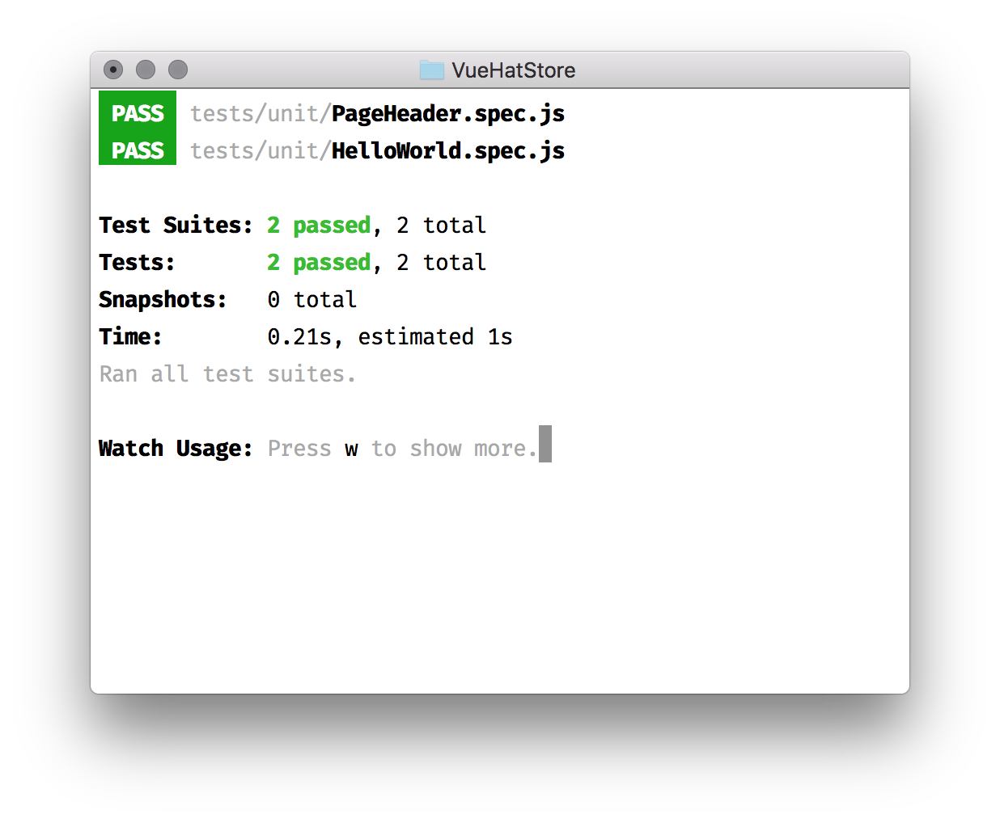

# Creating an online hat store

Let's build something real. We would create an e-commerce website; online hat store. In this chapter, we would:

1. Create a project with Vue CLI
1. Configure IDE and browser
1. Setup unit testing environment

We would start with scaffolding a project with Vue CLI. Then, we'll configure our IDE to support `.vue` files and then we will add dev tools to the browser. Then, we will setup unit tests before getting into actual application development.

## Scaffolding a project

In theory, We can use Vue with a script tag, and there is no need for any build setup. This approach works when writing demos or small throw-away prototypes. For real-world enterprise applications, we need some robust, optimized and deterministic configuration.

Vue comes with a cross-platform CLI tool. The Vue CLI tool has a dependency on node.js. If you don't have the latest version of node.js installed, you may the installation guide at [github.com/nodejs/node/wiki/Installation](https://github.com/nodejs/node/wiki/Installation).

We would install the CLI tool globally. Go ahead and run following script in the terminal.

``` bash
npm add -g @vue/cli
```

The Vue CLI (`@vue/cli`) package provides one command: `vue`. Let's use the command to scaffold a new project.

``` bash
vue create VueHatStore
```

Above command would ask for a preset, let's go with default (babel and eslint plugins only). It will create a new project in `VueHatStore` directory. The project works out of the box. Let's try it out.

``` bash
npm run serve
```

Above command would start a development server and open up the website in the default browser. Yay! We have successfully scaffolded a project for out hat store.


We know Vue can be used with a simple `<script>` tag. In large applications, we have dozens or hundreds of components, the `<script>` tag approach is not feasible in such scenario. For such projects, we need comprehensive build tools. The project scaffolded with Vue CLI has preconfigured support for template compilation, bundling, code splitting and a development server with hot module replacement. 

## Application structure overview

The above-scaffolded project has following directory structure:


The `public/` directory contains static files that are copied to the final build. The `public/index.html` is a template which would be processed during the build and asset links are injected automatically.

The `src/` directory contains the application code. The `src/main.js` is the entry point of the application; it creates a new Vue instance and mounts it to the element with id `#app`. The `src/assets/` directory contains resources like images and fonts. The `src/components/` directory contains Vue component and the `src/App.vue` is the root component.

## Configuring the development environment

We need a code editor which supports Vue syntax and `.vue` files, and a browser to preview and debug our application.

### Configuring IDE

Visual Studio Code popular IDE among Vue developers. The **Vue.js Extension Pack** by _Muhammad Ubaid Raza_ is a collection of essential plugins which supercharges VS Code with Vue experience. The extension pack includes:

1. **vetur** - syntax highlight and intelli-sense
1. **vue-peek** - goto definition
1. **auto-rename-tag** and **auto-close-tag** - paired tag rename and auto close

Atom, IntelliJ (Webstorm et al.), Sublime Text and Vim also support Vue.

### Configuring Browser

Vue provides a devtools extension for Chrome and Firefox. The extension allows us to see the component tree, component data (props, data, and computed properties), Vuex mutations and component events. It helps to inspect a Vue application and track bugs.

<!-- TODO: Maybe write about *how to install devtools*. -->

The dev tools pane has three tabs:

1. Components
1. Vuex
1. Events


The components tab, as shown in the screenshot, has a component tree on the left and details of a selected component on the right. We will explore dev tools in further chapters.

<!-- TODO: Maybe show *open in editor* and *HMR*. -->

## Configuring the test environment

We have an IDE to work on our application and a browser to preview and debug. Next, we need a unit testing setup to know that our components are behaving as expected deterministically.

The unit test setup consists of three essential elements:

1. A test runner
1. An assertion library
1. Tools for stubbing, faking and mocking data

### Choosing a test runner

The JavaScript ecosystem has dozens of test runner and Vue works with anything that supports module based build system. There is one fundamental requirement; the test runner should support pre-compilation to process `.vue` files with Vue compiler.

We would use **jest** as it is feature rich, requires minimal configuration, comes pre-configured with JSDOM, built-in assertions and an excellent command line experience.

### Setting up the test environment

Let's add jest to our project.

``` bash
npm add -D @vue/cli-plugin-unit-jest
```

And then we have to invoke the plugin's generator to create the necessary configuration and example files.

``` bash
vue invoke unit-jest
```

Above command created an example test case in `tests/unit/HelloWorld.spec.js` file.


The `jest.config.js` configures jest to handle `.vue` files.

Let's run the tests.

``` bash
npm test
```

### Crash course: Test Driven Development

Test Driven Development can be summarized into the _red-green-refactor_ cycle. _Red_ means there is a failing test case and _green_ means all tests are passing. So, we write a failing test (_red_) then we make it pass quickly (_green_), then, we _refactor_ our code to optimize the task, and we keep repeating the process.


## Creating the hat store

We have a working development and testing environment for our project. Next, we will conceptualize the structure of the application to convert it to a navigatable sitemap. Then, we will take pages from the sitemap to draw low fidelity mockups. We will refer these mockups to create components required for the application.

### Create the sitemap

A sitemap is the information hierarchy of the application. It lists all pages and their interlinks, which users use to navigate through the application. In our hat store web application, we have some resources (e.g., hats) and information (e.g., items in cart). Let's create a simple sitemap for it.


Our homepage, links to a list of hats, a list of categories and some other informational pages. The primary resource of the application is the **list of hats**. We will start with building the products (list of hats) page.

Above sitemap is a minimalistic view of the hat store application. In upcoming chapters, we would create a more detailed sitemap to design the processes and user interface.

### Create UI mocks

From sitemap, we know the hierarchy of the information and the UI mocks provide the visual representation. Let's create low fidelity wireframes or UI mocks for the products page.


Next, we break down the products page into small independent parts, i.e., components.


We have three components, namely:

1. Header Component
1. Product Card Component
1. Product List Component

### The development process

Components are reusable building blocks of an application. A robust building block would make a robust application. We will build and test components in isolation.

Let's build the header component. We will follow above-discussed TDD approach.
We will start jest in watch mode before writing any code.

``` bash
npm test -- --watchAll
```


Let's add a new test file. Create `test/unit/PageHeader.spec.js` with the following content.

``` js
import { shallow } from '@vue/test-utils'
import PageHeader from '@/components/PageHeader.vue'

describe('<PageHeader>', () => {
  it('has name', () => {
    expect(PageHeader.name).toEqual(expect.stringContaining('PageHeader'))
  })
  // More tests here...
})
```

Above test case verifies that component has a name. Vue uses component's name in logs and errors. It is easier to debug if we set component name.


Let's write the code required to pass above test. Create `src/components/PageHeader.vue` with following content.

``` html
<script>
export default {
  name: 'PageHeader'
}
</script>
```



We will follow the same process to create the application.

### The products page

Let's create the products page for our hat store. We store the page components in `src/pages/` directory. Go ahead and create `ProductsPage.vue` file in `src/pages/` directory.

Before creating the component, we need a data source for the list of products to display. Let's create a mock data source. Create `products.json` file in `src/data/` directory with following content. <!-- TODO: Add full list of hats products -->

``` json
[
  {
    "id": 1,
    "name": "Example 1",
    "photo": "//picsum.photos/200?1",
    "price": 100
  },
  {
    "id": 2,
    "name": "Example 2",
    "photo": "//picsum.photos/200?2",
    "price": 100
  },
]
```

We will display products from above mock source.

``` html
<template>
  <div>
    <header>Products</header>
    <div v-for="product in products">
      {{ product.name }}
      {{ product.photo }}
      {{ product.price }}
    </div>
  </div>
<template>

<script>
import products from '@/data/products.json'

export default {
  name: 'ProductsPage',
  components: {},
  data: () => ({ products })
}
</script>
```

We are not writing unit tests for `ProductsPage.vue` as this would be covered by integration tests. We will discuss integration tests in further chapters.

We would use this component in the `<App>` component.

``` html
<template>
  <div id="app">
    <ProductsPage />
  </div>
</template>

<script>
import ProductsPage from './pages/ProductsPage.vue'

export default {
  name: 'app',
  components: {
    ProductsPage
  }
}
</script>

<style>
#app {
  font-family: 'Avenir', Helvetica, Arial, sans-serif;
  -webkit-font-smoothing: antialiased;
  -moz-osx-font-smoothing: grayscale;
  text-align: center;
  color: #2c3e50;
  margin-top: 60px;
}
</style>
```

We have a minimal products page. Go ahead and open it in browser.

``` bash
npm run serve
```

Next, we would take parts from the `<ProductsPage>` and replace with smaller components. As discussed in the UI mocks section, we need three components to create the product page. Let's create the components.

#### PageHeader component

Let's write the specification for the `<PageHeader>` component first.

``` js
import { shallow } from '@vue/test-utils'
import PageHeader from '@/components/PageHeader.vue'

describe('<PageHeader>', () => {
  it('has name', () => {
    expect(PageHeader.name).toEqual(expect.stringContaining('PageHeader'))
  })

  it('accepts title prop', () => {
    const wrapper = shallow(PageHeader, { propsData: { title: 'my title' } })
    const props = wrapper.vm.$options.props

    expect(props.title).toBeTruthy()
    expect(props.title.type).toEqual(String)
    expect(props.title.required).toEqual(true)
  })

  it('renders', () => {
    const wrapper = shallow(PageHeader, { propsData: { title: 'my title' } })

    expect(wrapper.find('h1').text()).toEqual(expect.stringContaining('my title'))
  })
})
```

Now the component should pass above tests.

``` html
<template>
  <h1>{{ title }}</h1>
</template>

<script>
export default {
  name: 'PageHeader',
  props: {
    title: {
      type: String,
      required: true
    }
  }
}
</script>
```

As we are in the green state we can refactor, optimize or style the component.

``` html
<template>
  <h1 class="header">{{ title }}</h1>
</template>

<script>
export default {
  name: 'PageHeader',
  props: {
    title: {
      type: String,
      required: true
    }
  }
}
</script>

<style scoped>
.header {
  font-size: 2rem;
  line-height: 1.125;
}
</style>
```

We will use it in the products page.

``` html
<template>
  <div id="app">
    <PageHeader title="Products"/>
    <div v-for="product in products">
      {{ product.name }}
      {{ product.photo }}
      {{ product.price }}
    </div>
  </div>
</template>

<script>
import PageHeader from '@/components/PageHeader.vue'
import products from '@/data/products.json'

export default {
  name: 'ProductsPage',
  components: {
    PageHeader
  },
  data: () => ({ products })
}
</script>
```

#### ProductCard component

As usual, we would write the specification first.

``` js
import { shallow } from '@vue/test-utils'
import ProductCard from '@/components/ProductCard.vue'

describe('<ProductCard>', () => {
  it('has name', () => {
    expect(ProductCard.name).toEqual(expect.stringContaining('ProductCard'))
  })

  describe('props', () => {
    const props = shallow(ProductCard, { 
      propsData: { name: 'my title', photo: '', price: 0 }
    }).vm.$options.props

    it('accepts name prop', () => {
      expect(props.name).toBeTruthy()
      expect(props.name.type).toEqual(String)
      expect(props.name.required).toEqual(true)
    })

    it('accepts photo prop', () => {
      expect(props.photo).toBeTruthy()
      expect(props.photo.type).toEqual(String)
      expect(props.photo.required).toEqual(true)
    })

    it('accepts price prop', () => {
      expect(props.price).toBeTruthy()
      expect(props.price.type).toEqual(Number)
      expect(props.price.required).toEqual(true)
    })

    it('accepts featured prop', () => {
      expect(props.featured).toBeTruthy()
      expect(props.featured.type).toEqual(Boolean)
      expect(props.featured.required).toBeFalsy()
      expect(props.featured.default).toEqual(false)
    })
  })

  it('renders', () => {
    const wrapper = shallow(ProductCard, { propsData: { name: 'my title', photo: 'fake-url', price: 100.50 } })

    expect(wrapper.find('div').text()).toEqual(expect.stringContaining('my title'))
    expect(wrapper.find('img').attributes().src).toEqual('fake-url')
    expect(wrapper.find('span.price').text()).toEqual(expect.stringContaining('100.50'))
  })
})
```

And the component should pass above tests.

``` html
<template>
  <div>
    
    <div>
      {{ name }} <span class="price">{{ displayPrice }}</span>
    </div>
  </div>
</template>


<script>
export default {
  name: 'ProductCard',
  props: {
    name: { type: String, required: true },
    photo: { type: String, required: true },
    price: { type: Number, required: true },
    featured: { type: Boolean, default: false }
  },
  computed: {
    displayPrice () {
      return '$' + (this.price.toFixed(2))
    }
  }
}
</script>
```

Back to the green state. Let's add some styles to `<ProductCard>` component.

``` html
<template>
  <div class="card">
    <div class="card-top">
      
      <div class="title">
        {{ name }} <span class="price">{{ displayPrice }}</span>
      </div>
    </div>
  </div>
</template>


<script>
export default {
  name: 'ProductCard',
  props: {
    name: { type: String, required: true },
    photo: { type: String, required: true },
    price: { type: Number, required: true },
    featured: { type: Boolean, default: false }
  },
  computed: {
    displayPrice () {
      return '$' + (this.price.toFixed(2))
    }
  }
}
</script>

<style scoped>
.card {
  background-color: white;
  border-radius: 2px;
  margin: .5rem 0 1rem 0;
  box-shadow: 0 2px 2px 0 rgba(0,0,0,0.14), 0 1px 5px 0 rgba(0,0,0,0.12), 0 3px 1px -2px rgba(0,0,0,0.2);

  display: inline-flex;
  flex-direction: column;
}

.card-top {
  position: relative;
}

.photo {
  display: block;
  border-radius: 2px 2px 0 0;
  position: relative;
  left: 0;
  right: 0;
  top: 0;
  bottom: 0;
  width: 100%; 
}

.title {
  padding: .5em;
  font-size: 1.25rem;
  line-height: 1.325;
}

.price {
  font-weight: bold;
  display: inline-block;
  margin: 0 .5em;
}
</style>
```

We will use it in the products page.

``` html
<template>
  <div id="app">
    <PageHeader title="Products"/>
    <ProductCard
      v-for="product in products"
      v-bind="product"
      :key="product.id"
    />
  </div>
</template>

<script>
import PageHeader from '@/components/PageHeader.vue'
import ProductCard from '@/components/ProductCard.vue'
import products from '@/data/products.json'

export default {
  name: 'ProductsPage',
  components: {
    PageHeader,
    ProductCard
  },
  data: () => ({ products })
}
</script>
```

#### ProductList component

We compose a list component using above created `<ProductCard>` component. Let's write the test.

``` js
import { shallow } from '@vue/test-utils'
import ProductList from '@/components/ProductList.vue'
import ProductCard from '@/components/ProductCard.vue'

describe('<ProductList>', () => {
  it('has name', () => {
    expect(ProductList.name).toEqual(expect.stringContaining('ProductList'))
  })

  describe('props', () => {
    const props = shallow(ProductList, { propsData: { products: [] }}).vm.$options.props

    it('accepts products prop', () => {
      expect(props.products).toBeTruthy()
      expect(props.products.type).toEqual(Array)
      expect(props.products.required).toEqual(true)
    })
  })

  it('renders', () => {
    const wrapper = shallow(ProductList, { 
      propsData: { products: [
        { name: 'Example Product 1', photo: 'fake-url', price: 100.50 },
        { name: 'Example Product 2', photo: 'fake-url', price: 200.50 }
      ] }
    })

    expect(wrapper.contains(ProductCard)).toBeTruthy()
    expect(wrapper.findAll(ProductCard).length).toEqual(2)
  })
})
```

Let's write the code required for the `<ProductList>` component.

``` html
<template>
  <div class="products">
    <div class="product" v-for="product in products" :key="product.id">
      <ProductCard v-bind="product"/>
    </div>
  </div>
</template>

<script>
import ProductCard from './ProductCard.vue'

export default {
  name: 'ProductList',
  props: {
    products: {
      type: Array,
      required: true
    }
  },
  components: {
    ProductCard
  }
}
</script>

<style scoped>
.products {
  display: flex;
  flex-direction: row;
  flex-wrap: wrap;
}

.product {
  padding: 1rem;
  flex-basis: 20%;
  box-sizing: border-box;
}

.product > * {
  width: 100%;
}
</style>
```

We can delegate the list rendering logic of products page to `<ProductList>` component.

``` html
<template>
  <div id="app">
    <PageHeader title="Products"/>
    <ProductList :products="products"/>
  </div>
</template>

<script>
import PageHeader from '@/components/PageHeader.vue'
import ProductList from '@/components/ProductList.vue'
import products from '@/data/products.json'

export default {
  name: 'ProductsPage',
  components: {
    PageHeader,
    ProductList
  },
  data: () => ({ products })
}
</script>
```

We have first page of the application ready.


